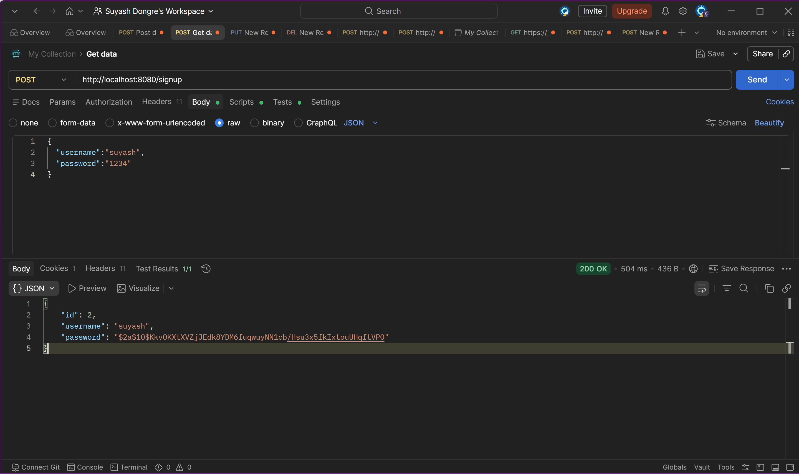
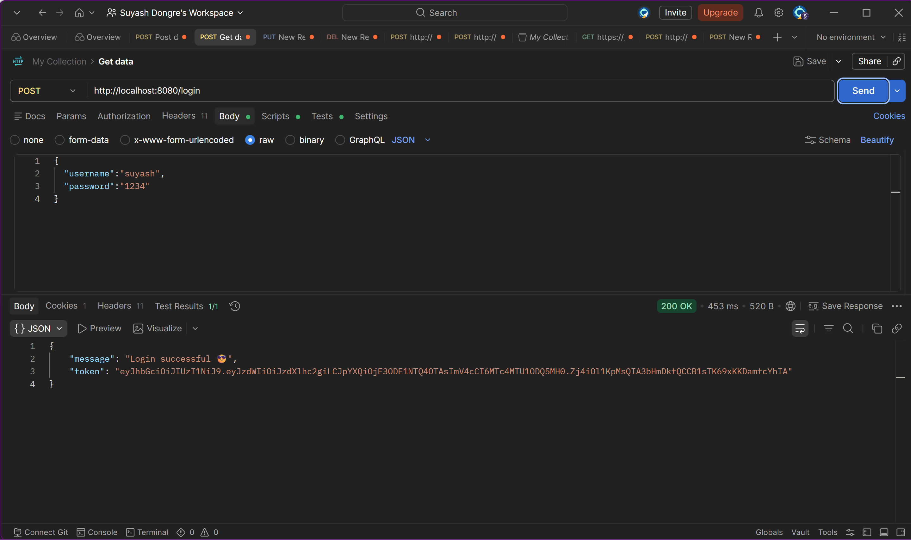
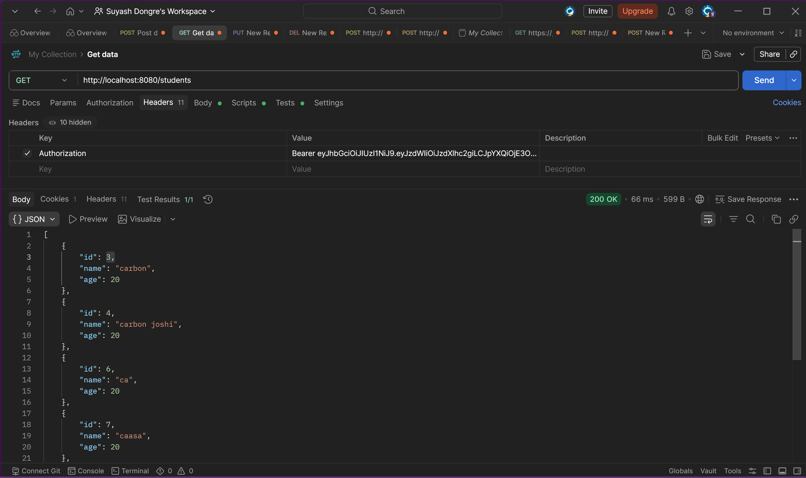
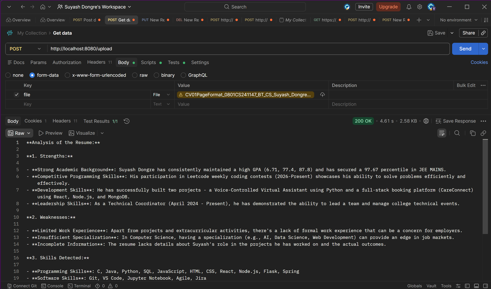

# AI Resume Analyzer 🚀

An AI-powered Resume Analyzer built using Spring Boot, JWT Authentication, MySQL, Apache PDFBox and Groq API integration.

---

## Features ✨

* Upload Resume PDF
* Extract Text from PDF
* AI-based Resume Analysis
* JWT Authentication
* Protected APIs using Spring Security
* MySQL Database Integration
* REST APIs

---

## Tech Stack 🛠️

### Backend

* Java
* Spring Boot
* Spring Security
* JWT
* Spring Data JPA

### Database

* MySQL

### AI Integration

* Groq API

### PDF Processing

* Apache PDFBox

---

## API Endpoints 📌

### Authentication

#### Signup

```http
POST /signup
```

#### Login

```http
POST /login
```

---

### Resume APIs

#### Upload Resume

```http
POST /upload
```

#### Get Students

```http
GET /students
```

---

## JWT Authentication 🔐

Protected APIs require JWT token.

Example Header:

```http
Authorization: Bearer your_token_here
```

---

## How To Run ▶️

### Clone Repository

```bash
git clone YOUR_REPO_LINK
```

---

### Open Project

Open in IntelliJ IDEA.

---

### Configure Database

Update:

```properties
application.properties
```

Example:

```properties
spring.datasource.url=jdbc:mysql://localhost:3306/resume_db
spring.datasource.username=root
spring.datasource.password=YOUR_PASSWORD

groq.api.key=YOUR_API_KEY
```

---

### Run Application

Run:

```text
ResumeanalyzerApplication.java
```

---

## Future Improvements 🚀

* React Frontend
* Resume History
* Deployment
* Better UI

---
## Screenshots 📸

### Signup API



---

### Login API with JWT Token



---

### Protected API using JWT Authentication



---

### Resume Upload & AI Analysis



## Author 😎

Suyash Dongre
